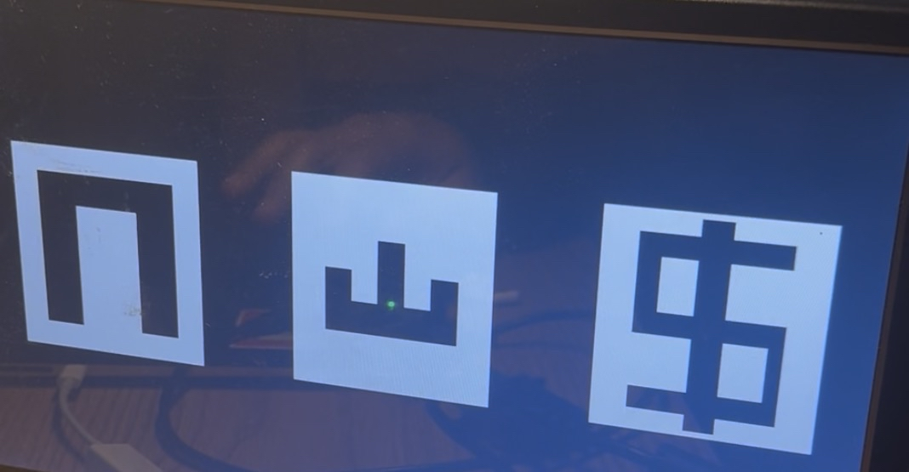
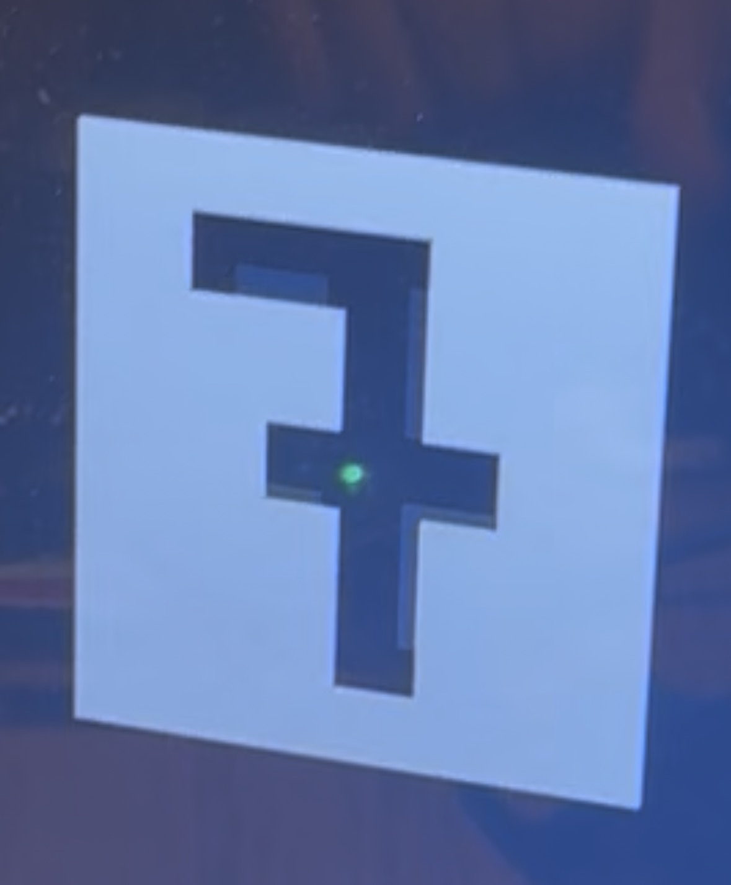
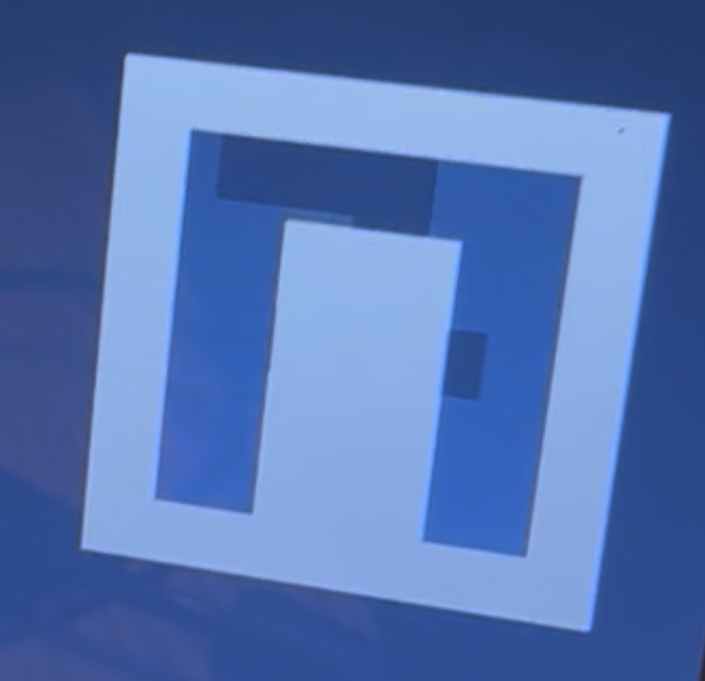
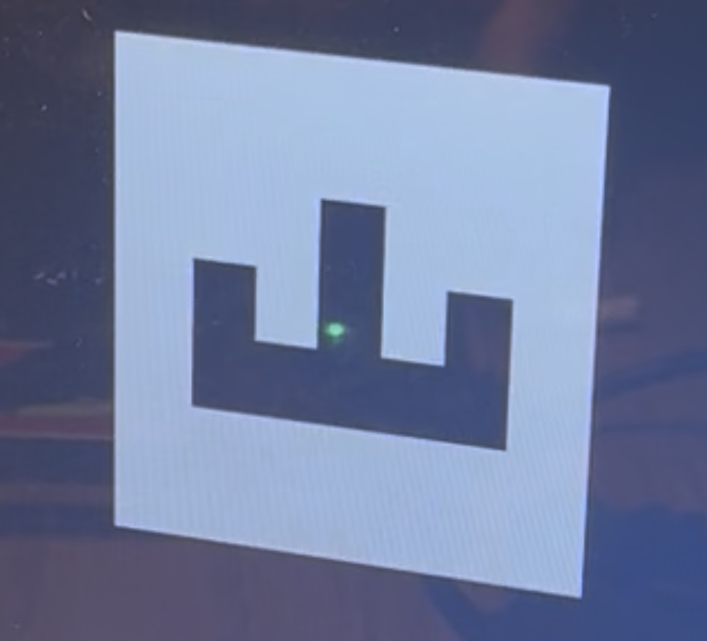
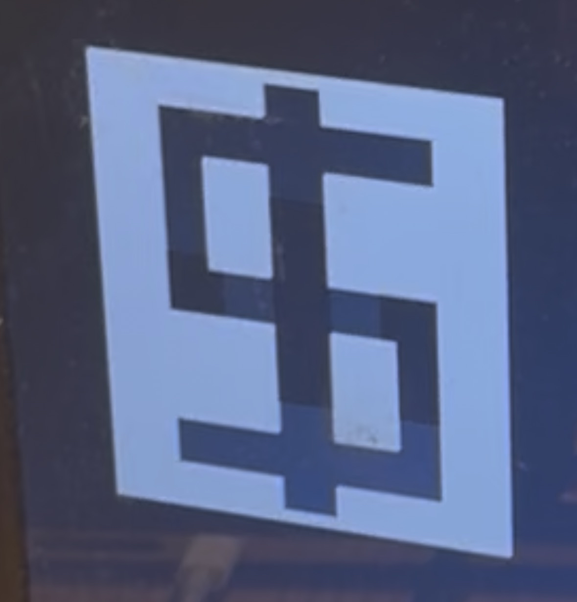

   

# VGA Slot Machine

- [Read the documentation for project](docs/info.md)

Hello all! My name is Edward Lei and my Project is the VGA Slot Machine! I hope you enjoy!

-- VGA SLOT MACHINE --

-- SET UP --

Before I get into the details of how my design operates and how to use it, I need to go over how to set things up. There are a few things you need in addition to the physical chip that my design will be on.

1. You will need a monitor display system/device that can support a VGA display. This means that whatever device you are using to display my project will need to support the VGA cable and have a VGA input port for the cable. The reason why you need a display device that supports VGA is because my design utilizes VGA as its display mechanism, so in order to see my design in action you need a display device that supports VGA. The Kenowa portable VGA monitor is a great low cost display device that supports VGA if you are looking to purchase a VGA display. 

2. TinyTapeout VGA PMOD. Link to purchase one if you don't have one: https://store.tinytapeout.com/products/
Tiny-VGA-Pmod-p678647356. This PMOD will be connected to the chip's output pins, specifically map and connect the output pins of the chip to the pins of the TinyTapeout VGA PMOD pins like so: 

(uo_out[#] refers to the #'th output pin of the chip) \
uo_out[0] => R1 \
uo_out[1] => G1 \
uo_out[2] => B1 \
uo_out[3] => VS \
uo_out[4] => R0 \
uo_out[5] => G0 \
uo_out[6] => B0 \
uo_out[7] => HS 

3. Two push buttons. You will need one push button that connects to the chip's input port 0 (ui_in[0]). This first button will serve as your "lever" that you can "pull" to start the slot machine. Essentially this button will allow you to spin the slot machine and allows you to actually interact with the slot machine. The second push button should be connected to the chips "rst_n" input port. This button will allow for you to reset the slot machine in case of any errorneous behavior and allows you to start the slot machine interaction process over again and eliminates the errorneous behavior.   

** I will refer to the button that you hook up to the chip's input port 0 as the start button and the button that you hook up to the chip's rst_n port as the reset button **

4. Make sure that the clock signal that you are using is at 25 Mhz

To recap: You need a display device that supports VGA, a TinyTapeout VGA PMOD, and two push buttons. You also must ensure that the chip output port connections to the TinyTapeout VGA PMOD pins match exactly what I stated above otherwise the diplay WILL NOT WORK. You also must ensure that both the rst_n input port and the ui_in[0] (input port 0) for the chip gets wired up to a push button other wise you will not be able to interact with the slot machine. Finally, ensure that the clock signal that you are using is at 25 MHz. 
 
-- WHAT IT LOOKS LIKE --

Now that you have fully connected and set up the slot machine, on your display device you should see three white rectangles appear in a line across the center of your display screen. My slot machine design features only 3 slots. Each white rectange represents a slot. Each slot has a symbol "on top" of it. My slot machine design features 4 symbols, meaning each slot can only take on 1 of 4 symbols. The symbols that are supported are: The number 7, a horseshoe, a crown, and a dollar sign. 

This is what the slot machine should look like on your display

The number seven symbol looks like this: 

The horseshoe symbol looks like this: 

The crown symbol looks like this:

The dollar sign symbol looks like this: 

-- FUNCTIONALITY --

Now that you have my slot machine design properly set up and know what it looks like, let me walk you through how the design works. 

-- INITIALLY --

At the very beginning, meaning immediately after you set up everything and the slot machine design is being displayed on your VGA monitor, the 3 slots will begin to flash a series of different combinations of symbols. This is simply the "seeding" period where the slot machine runs through a series of symbol patterns that acts as the "seed" for the slot machine. What this means is just what symbols the slot machine starts spinning at. While the symbols are flashing, you can at any point press your start button to begin the spinning process. 

-- SPINNING -- 

When the slot machine begins spinning, you will notice that the symbols begin flashing at a much faster rate. All three slots will spin (meaning they are cycling through a sequence of symbols) and you will see each slot taking on different symbols every time it flashes. After around ~5 seconds, the first slot will stop spinning and a symbol value will be decided (the other two slots will still be spinning). Then after ~3 seconds the second slot will stop spinning  and a symbol value will be decided (the last slot will still be spinning). Finally after another ~3 seconds, the third slot will stop spinning and you will have your resulting sequence of symbols. At this point all three slots will have stopped spinning and they will be displaying your symbol sequence. If you wish to spin the slot machine again, you can simply press the start button again and it will begin the spinning process all over again and give you a new symbol sequence. 

-- WINNING --
The name of the game here is to get 3 of the same symbol in a row. If you get a resulting sequence of symbols to be the same symbol for each slot, then you have won! Congratulations. 

 